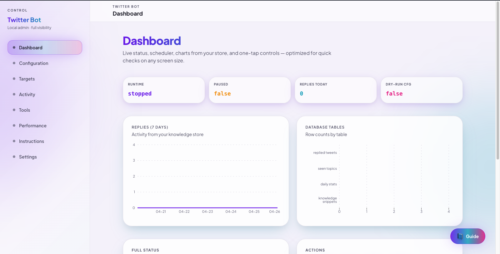
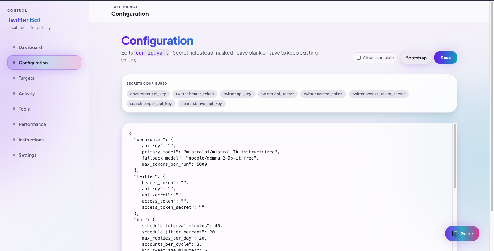
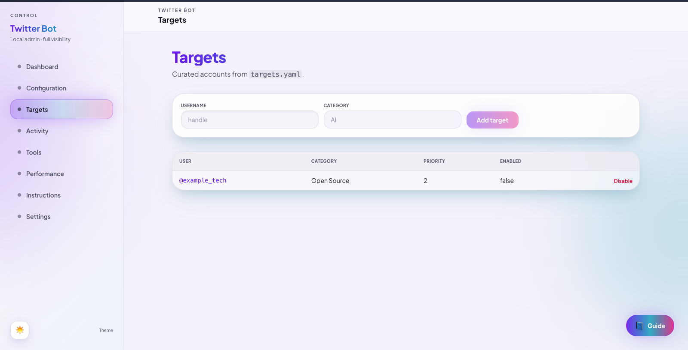
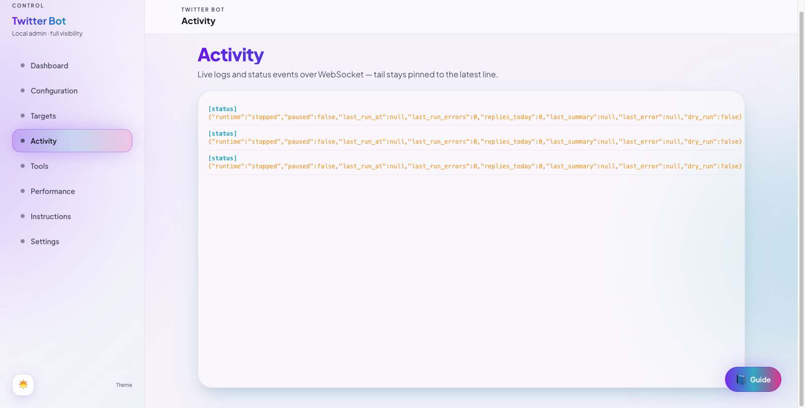
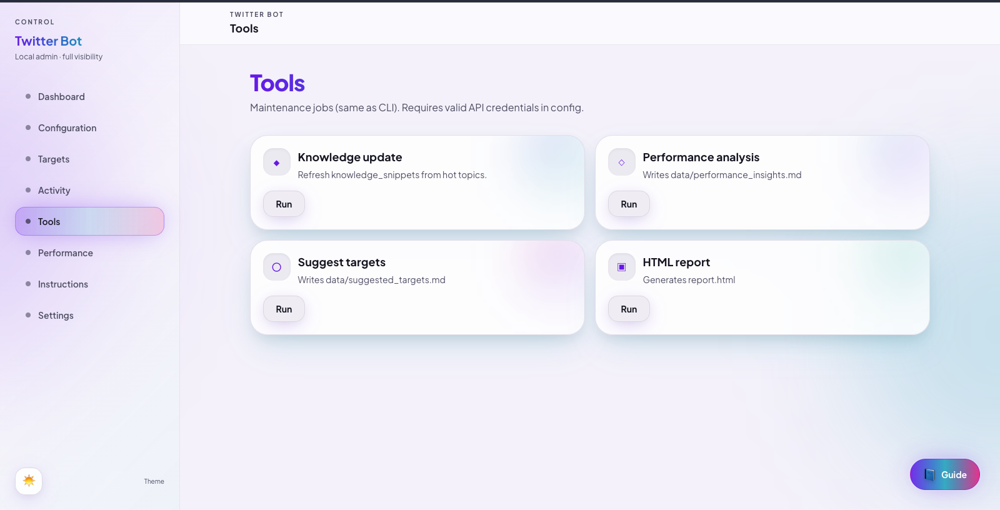
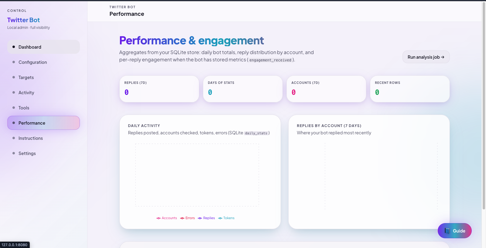
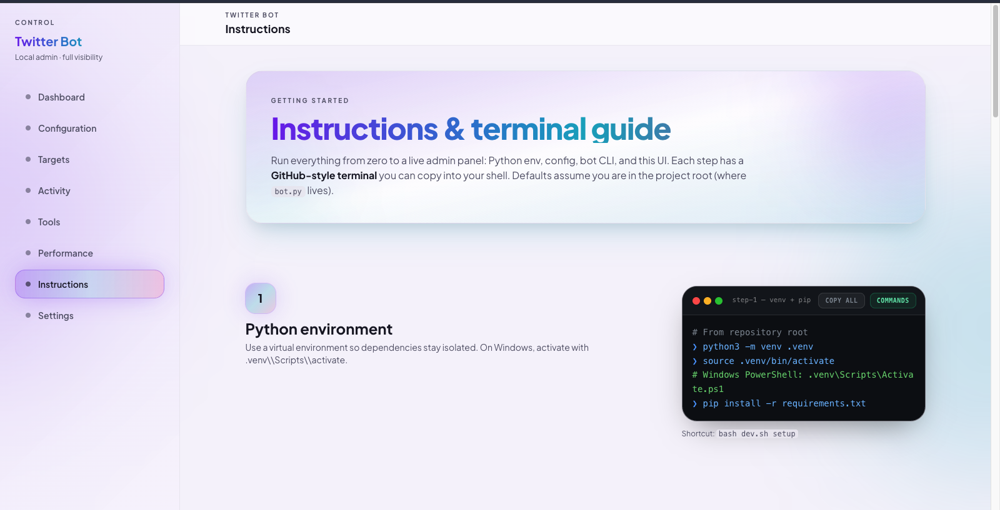
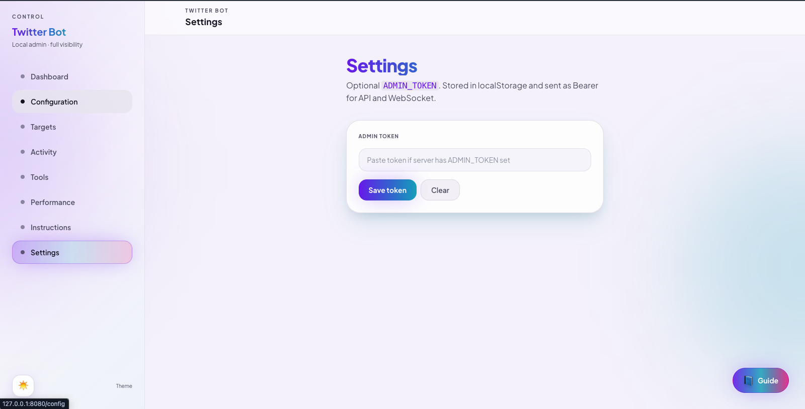

# Twitter Dev-Bot

An autonomous **X (Twitter)** engagement assistant for developers. It monitors a curated list of accounts, reads new posts, optionally enriches context from the web, and drafts short replies that match a consistent technical persona. The project is built for **careful, human-paced** automation: configurable safety filters, daily caps, scheduler jitter between cycles, and a first-class **dry-run** path so you can validate behaviour before anything is published.

Internally the code is **modular**: configuration loading, structured logging, the X API client, OpenRouter-backed LLM calls, pluggable search (DuckDuckGo or paid APIs), a SQLite **knowledge store**, scheduling, and the main loop are separate packages under `src/`. You can test and swap components without rewriting the whole stack.

---

## Table of contents

1. [Features](#features)
2. [Architecture overview](#architecture-overview)
3. [Prerequisites](#prerequisites)
4. [Installation](#installation)
5. [Running on Android (Termux)](#running-on-android-termux)
6. [Configuration](#configuration)
7. [Data files and persistence](#data-files-and-persistence)
8. [Running the bot (CLI)](#running-the-bot-cli)
9. [Local admin panel](#local-admin-panel)
10. [Admin UI screenshots](#admin-ui-screenshots)
11. [Admin HTTP API (summary)](#admin-http-api-summary)
12. [Helper script: `dev.sh`](#helper-script-devsh)
13. [Tests and quality](#tests-and-quality)
14. [Troubleshooting](#troubleshooting)
15. [Documentation map](#documentation-map)
16. [Compliance](#compliance)

---

## Features

- **Scheduler-driven loop** with interval + jitter; pause/resume via shared state (`data/bot_state.json`) for both CLI and admin UI.
- **Dry-run** per cycle or via `bot.dry_run` in YAML.
- **Targets** in `data/targets.yaml` (categories, priorities); CLI and admin CRUD.
- **LLM comment generation** via [OpenRouter](https://openrouter.ai/) with primary/fallback models and token budgets.
- **Web search** optional: DuckDuckGo (default), or Serper / Brave with API keys.
- **Safety layer**: caps, spacing between posts, blacklist and tragedy-keyword guards, similarity to recent replies.
- **SQLite store**: replied tweets, daily aggregates, topics, knowledge snippets; feeds reports and admin analytics.
- **Maintenance commands**: knowledge refresh, performance analysis (metrics + LLM summary markdown), target suggestions, HTML report.
- **Local admin stack**: FastAPI + React SPA—runtime control, masked config editing, live logs (WebSocket), charts, performance dashboard, in-app instructions.

---

## Architecture overview

```text
┌─────────────────┐     ┌──────────────────┐     ┌─────────────────────────┐
│  admin-ui/      │────▶│  run_admin.py    │────▶│  BotRuntimeService      │
│  (Vite + React) │ REST│  FastAPI + WS    │     │  + MainLoop + Scheduler │
└─────────────────┘     └──────────────────┘     └───────────┬─────────────┘
                                                               │
┌─────────────────┐     ┌──────────────────┐                  │
│  bot.py (CLI)   │────▶│  src/            │◀─────────────────┘
└─────────────────┘     │  config, twitter,│
                        │  llm, main_loop, │
                        │  knowledge_store │
                        └──────────────────┘
```

- **`bot.py`** — long-running CLI entry (foreground loop).
- **`run_admin.py`** — serves HTTP/WebSocket; optional background **single** bot thread through `BotRuntimeService` (do not run two loops against the same DB/state unintentionally).
- **`src/admin/`** — admin-only code: routers, config repository, log broadcaster, runtime service.

---

## Prerequisites

| Requirement | Notes |
|-------------|--------|
| **Python 3.11+** | Tested on 3.13. |
| **X Developer account** | App with **OAuth 1.0a user** context (post replies) and **Bearer token** (reads, e.g. timelines). |
| **OpenRouter API key** | For chat completions; model IDs configured in YAML. |
| **Optional: Serper / Brave** | If `search.provider` is not `duckduckgo`. |
| **Node.js 18+** | Only if you build or develop `admin-ui/`. |

---

## Installation

1. **Clone** the repository and `cd` into the project root.

2. **Create a virtual environment** and install dependencies:

   ```bash
   python3 -m venv .venv
   source .venv/bin/activate
   # Windows: .venv\Scripts\activate
   pip install -r requirements.txt
   ```

   Equivalent: `bash dev.sh setup`

3. **Configure the bot** (see [Configuration](#configuration)).

4. **Smoke-test** configuration:

   ```bash
   python bot.py bootstrap --config config.yaml
   ```

5. **Prefer dry-run** until you trust settings:

   ```bash
   python bot.py dry-run --config config.yaml
   ```

---

## Running on Android (Termux)

[Termux](https://termux.dev/) gives you a Linux-like environment on Android. You can run the **Python bot** and **`run_admin.py`** on the device; the admin UI opens in the phone browser at `http://127.0.0.1:<port>/`.

### 1. Install Termux

- Prefer **Termux from [F-Droid](https://f-droid.org/packages/com.termux/)** (current maintenance model).  
- Open Termux once so it can unpack; run **`termux-setup-storage`** if you want shared storage under `~/storage/`.

### 2. Packages

```bash
pkg update && pkg upgrade -y
pkg install -y python git openssl
# Optional: compilers for pip wheels that build from source
pkg install -y build-essential
```

Python on Termux is often **3.11+**; confirm with `python3 --version`.

### 3. Get the project

```bash
cd ~
git clone <your-repo-url> twitter_bot
cd twitter_bot
```

(Or copy the project into `~/twitter_bot` with a file manager + zip.)

### 4. Virtual environment and dependencies

```bash
python3 -m venv .venv
source .venv/bin/activate
pip install --upgrade pip
pip install -r requirements.txt
```

If **`pip install` fails** on a package with native code, ensure **`build-essential`** is installed and retry; on rare builds you may need extra `pkg install` libraries—check the error line from the compiler.

### 5. Config and data

```bash
cp config.example.yaml config.yaml
# Edit with nano/vim; set paths under the project (defaults like data/ work)
nano config.yaml
```

Keep **`config.yaml`** only on the device; do not sync secrets to cloud backups you do not trust.

### 6. Run the bot (CLI)

With venv activated and `cd` in the project root:

```bash
python bot.py bootstrap --config config.yaml
python bot.py dry-run --config config.yaml
python bot.py start --config config.yaml
```

**Long sessions:** Android may throttle background work. In system settings, **disable battery optimization** for Termux where possible, and run under **`tmux`** so you can detach without stopping the process:

```bash
pkg install -y tmux
tmux new -s bot
source .venv/bin/activate
python bot.py start --config config.yaml
# Detach: Ctrl+b then d
```

### 7. Admin panel on the phone

```bash
source .venv/bin/activate
python run_admin.py
```

Default: **http://127.0.0.1:8080/** in **Chrome (or Firefox) on the same device**.  
Another port:

```bash
ADMIN_PORT=9090 python run_admin.py
```

**Built SPA:** install Node, build once, then start the server:

```bash
pkg install -y nodejs-lts
cd admin-ui && npm ci && npm run build && cd ..
python run_admin.py
```

**Dev UI with Vite** (optional): after changing `admin-ui/vite.config.ts` proxy targets if you changed `ADMIN_PORT`, run `npm run dev` in `admin-ui/` and open the URL Vite prints (usually port **5173**).

### 8. `dev.sh` on Termux

`dev.sh` is a Bash script; it works if **`bash`** is available (`pkg install bash` if needed):

```bash
bash dev.sh setup
bash dev.sh bootstrap
bash dev.sh admin
```

### Limitations and tips

| Topic | Notes |
|--------|--------|
| **Battery / Doze** | Long-running loops may stall when the screen is off; use wake lock or adjust Android battery settings for Termux. |
| **Network** | Same Wi‑Fi/cellular rules as any mobile client; X and OpenRouter must be reachable from the device. |
| **Storage** | SQLite and logs live under the project `data/` and `logs/`; Termux home is under `/data/data/com.termux/files/home/`. |
| **Not a server for other PCs** | Binding `127.0.0.1` is only on-device. Exposing `0.0.0.0` on Termux is possible but risky without firewall/TLS—prefer SSH tunnel or VPN if you need remote access. |

---

## Configuration

Copy **`config.example.yaml`** → **`config.yaml`** and replace every placeholder. **Never commit `config.yaml`** or real keys.

High-level sections:

| Section | Purpose |
|---------|---------|
| **`openrouter`** | API key, primary/fallback models, per-run token cap. |
| **`twitter`** | Bearer + OAuth 1.0a credentials for the same app. |
| **`bot`** | Schedule interval/jitter, caps, accounts per cycle, tweet age window, `dry_run`, tone (`humor_level`), follower floor. |
| **`search`** | `provider`, optional Serper/Brave keys, cache TTL. |
| **`safety`** | Daily cap, minimum minutes between posts, blacklist, tragedy keywords, max similarity to recent replies. |
| **`logging`** | Level, rotating file under `logs/`. |
| **`paths`** | `targets_file`, `bot_state_file`, SQLite `knowledge_db`, cache paths (defaults under `data/`). |

Edit **`data/targets.yaml`** for handles to watch (format in the example file).

---

## Data files and persistence

| Path | Role |
|------|------|
| `data/targets.yaml` | Curated target accounts (also editable via admin API). |
| `data/bot_state.json` | Scheduler pause flag and last-run metadata (shared with CLI). |
| `data/bot.db` (default) | SQLite: `replied_tweets`, `daily_stats`, `seen_topics`, `knowledge_snippets`. |
| `logs/bot.log` | Rotating log file (if configured). |

The knowledge DB powers **stats**, **reports**, admin **charts**, and **Performance** (engagement fields when stored in `score_breakdown`).

---

## Running the bot (CLI)

All examples assume `config.yaml` in the current directory; override with `--config /path/to/file.yaml`.

| Action | Command |
|--------|---------|
| Validate / warm up | `python bot.py bootstrap --config config.yaml` |
| Run scheduler loop | `python bot.py start --config config.yaml` |
| Single cycle, no post | `python bot.py dry-run --config config.yaml` |
| Pause | `python bot.py stop --config config.yaml` |
| Resume | `python bot.py resume --config config.yaml` |
| Status | `python bot.py status --config config.yaml` |
| Add target | `python bot.py add-target SomeHandle --category "AI" --config config.yaml` |
| Disable target | `python bot.py remove-target SomeHandle --config config.yaml` |
| Stats (JSON) | `python bot.py stats --config config.yaml` |
| Review recent replies | `python bot.py review --config config.yaml` |
| Clear reply history | `python bot.py clear-history --config config.yaml` |
| HTML report | `python bot.py report --out report.html --config config.yaml` |
| Knowledge update job | `python bot.py knowledge-update --config config.yaml` |
| Performance job (metrics + `performance_insights.md`) | `python bot.py performance --config config.yaml` |
| Suggest targets | `python bot.py suggest-targets --config config.yaml` |

Run **`python bot.py --help`** for the authoritative list of subcommands and flags.

---

## Local admin panel

The admin stack exposes a **browser UI** and **JSON API** on **`127.0.0.1:8080`** by default. It is intended for **local** use; exposing it on all interfaces without TLS, reverse proxy, and strong auth is unsafe.

### Start the API

```bash
source .venv/bin/activate
python run_admin.py
```

- Interactive API docs: [http://127.0.0.1:8080/docs](http://127.0.0.1:8080/docs)
- Environment: `ADMIN_BIND`, `ADMIN_PORT`, `ADMIN_RELOAD`, optional `ADMIN_TOKEN`, `BOT_CONFIG` (see [docs/ADMIN_PANEL.md](docs/ADMIN_PANEL.md)).

### Different host or port

The process started by `run_admin.py` uses:

| Variable | Default | Role |
|----------|---------|------|
| **`ADMIN_BIND`** | `127.0.0.1` | Listen address (interface). |
| **`ADMIN_PORT`** | `8080` | TCP port for HTTP and WebSocket. |

**Examples**

```bash
# API + UI on port 9090 (same machine)
ADMIN_PORT=9090 python run_admin.py
```

Open `http://127.0.0.1:9090/` (built SPA) and `http://127.0.0.1:9090/docs` (OpenAPI).

```bash
# Bind and port together
ADMIN_BIND=127.0.0.1 ADMIN_PORT=9090 python run_admin.py
```

With the helper script:

```bash
ADMIN_PORT=9090 bash dev.sh admin
```

**Vite dev mode** (`cd admin-ui && npm run dev`, default UI port **5173**) forwards `/api` and `/ws` to **`http://127.0.0.1:8080`** in [`admin-ui/vite.config.ts`](admin-ui/vite.config.ts). If you change the API port, update `server.proxy["/api"].target` and `server.proxy["/ws"].target` to match (for example `http://127.0.0.1:9090` and `ws://127.0.0.1:9090`), then restart the dev server.

**Built SPA** (`npm run build`): the browser uses the same origin as FastAPI, so only `ADMIN_PORT` / `ADMIN_BIND` need to match how you start `run_admin.py`.

**Caution:** Setting `ADMIN_BIND=0.0.0.0` listens on all interfaces; treat that as a network exposure and add TLS, a reverse proxy, and `ADMIN_TOKEN` (or stronger auth) before using it outside a trusted LAN.

### Serve the built SPA from the same origin

```bash
cd admin-ui && npm ci && npm run build && cd ..
python run_admin.py
```

Open [http://127.0.0.1:8080/](http://127.0.0.1:8080/) — static assets load from `admin-ui/dist` when present.

### Develop the UI (hot reload)

```bash
# Terminal 1
python run_admin.py

# Terminal 2
cd admin-ui && npm install && npm run dev
```

Vite dev server proxies `/api` and `/ws` to port **8080**.

### UI areas (React app)

| Area | Purpose |
|------|---------|
| **Dashboard** | Runtime status, start/stop/pause/resume/dry-run, charts (replies / DB counts). |
| **Configuration** | Edit config as JSON; masked secrets; bootstrap from example; optional incomplete validation. |
| **Targets** | List/add/disable targets (YAML-backed). |
| **Activity** | Live tail of redacted logs + status events (WebSocket). |
| **Tools** | Trigger maintenance jobs (knowledge update, performance, suggest targets, report). |
| **Performance** | Daily `daily_stats` charts, replies-by-account (7d), recent replies with engagement payloads when stored. |
| **Instructions** | Step-by-step terminal-style setup guide inside the app. |
| **Settings** | Optional `ADMIN_TOKEN` for browser (localStorage + Bearer). |

A **floating “Guide”** button appears on every page **except** Instructions, linking back to the setup guide.

### Admin UI screenshots

PNG previews live in [`screenshots/`](screenshots/). They were taken from the **local admin** app (layout, theme light/dark, and chart data depend on your environment).

#### Dashboard



#### Configuration



#### Targets



#### Activity



#### Tools



#### Performance & engagement



#### Instructions



#### Settings



### Authentication

If **`ADMIN_TOKEN`** is set on the server, send **`Authorization: Bearer <token>`** on REST calls. For **`/ws/events`**, pass **`?token=<token>`** (or Bearer if your client supports it on WebSocket). If unset, any local process that can reach the bind address can call the API—acceptable for solo development on loopback; use a token on shared machines.

---

## Admin HTTP API (summary)

Protected routes use the optional Bearer token; **`GET /api/health`** stays public.

| Method | Path | Description |
|--------|------|-------------|
| GET | `/api/health` | Liveness. |
| GET/PUT | `/api/config` | Masked GET; PUT saves full config (optional `?allow_incomplete=true`). |
| POST | `/api/config/bootstrap` | Seed `config.yaml` from example if missing. |
| GET | `/api/runtime/status` | Scheduler/runtime snapshot. |
| POST | `/api/runtime/start`, `stop`, `pause`, `resume`, `dry-run` | Control background loop / one-shot dry-run. |
| GET/POST | `/api/targets`, `/api/targets/{user}/disable` | Targets CRUD. |
| GET | `/api/replies/recent` | Recent replies from SQLite. |
| GET | `/api/stats/weekly` | Last-7-days reply rows (JSON). |
| GET | `/api/stats/performance` | Daily series, replies-by-account (7d), recent rows + engagement fields. |
| GET | `/api/db/summary` | Table row counts. |
| POST | `/api/replies/clear-history` | Wipe `replied_tweets`. |
| POST | `/api/jobs/knowledge-update`, `performance`, `suggest-targets`, `report` | Maintenance jobs. |
| WS | `/ws/events` | Stream of log/status events (redacted). |

Full detail and diagrams: **[docs/ADMIN_PANEL.md](docs/ADMIN_PANEL.md)**.

---

## Helper script: `dev.sh`

From the repo root, **`dev.sh`** picks up **`.venv`** when it exists. On some volumes `./dev.sh` is not executable—use **`bash dev.sh`**.

| Command | What it does |
|---------|----------------|
| `bash dev.sh help` | Print all subcommands. |
| `bash dev.sh setup` | Create `.venv` if needed; `pip install -r requirements.txt`. |
| `bash dev.sh test` | Remove stale `.coverage`; run **pytest** (extra args forwarded). |
| `bash dev.sh bootstrap` | `bot.py bootstrap` with `CONFIG` (default `config.yaml`). |
| `bash dev.sh start` | Start scheduler loop. |
| `bash dev.sh dry-run` | One dry-run cycle. |
| `bash dev.sh stop` / `resume` / `status` | Pause, resume, status. |
| `bash dev.sh admin` | `python run_admin.py`. |
| `bash dev.sh admin-build` | `npm ci` + `npm run build` in `admin-ui/`. |
| `bash dev.sh admin-dev` | `npm install` + `npm run dev` in `admin-ui/`. |

Override config path: `CONFIG=my.yaml bash dev.sh bootstrap`

Example tests with filters:

```bash
bash dev.sh test -- tests/test_admin_api.py -q
```

---

## Tests and quality

The suite uses **pytest** with coverage on `src/` (minimum **80%** in `pytest.ini`).

```bash
rm -f .coverage
pytest
```

Or: `bash dev.sh test`

External APIs are **mocked**. If coverage or SQLite errors mention a corrupt `.coverage` file, delete `.coverage` and run again.

---

## Troubleshooting

| Symptom | What to check |
|---------|----------------|
| **`config validation failed`** | Compare with `config.example.yaml`; placeholders like `REPLACE_ME` are rejected. |
| **X `401` / `403`** | Bearer and OAuth 1.0a keys must be from the same app; verify access to read timelines and post replies. |
| **`429` rate limits** | Reduce `accounts_per_cycle` or increase `schedule_interval_minutes`; client retries with backoff. |
| **OpenRouter errors** | `openrouter.api_key` and model IDs; fallback model is used when configured. |
| **Search / DuckDuckGo failures** | Network blocking; switch provider or use LLM-only path when search returns nothing. |
| **Admin UI 404 at `/`** | Run `npm run build` in `admin-ui` so `admin-ui/dist` exists. |
| **Admin `401`** | Match `ADMIN_TOKEN` in **Settings** (or `Authorization` header), or unset token for local-only dev. |
| **WebSocket disconnects** | With token enabled, pass `token` query on `/ws/events`. |
| **Two bots fighting** | Avoid running **`bot.py start`** and the admin **Start loop** against the same `bot.db` / state unless intentional. |
| **Termux / Android** | `pip install` fails compiling wheels → `pkg install build-essential` and retry. Loop stops when screen off → disable battery optimization for Termux, use **`tmux`**, see [Running on Android (Termux)](#running-on-android-termux). **`npm` / `node` missing** → `pkg install nodejs-lts`. |
| **pytest / coverage SQLite noise** | `rm -f .coverage` |

---

## Documentation map

| Document | Contents |
|----------|-----------|
| **This README** | End-to-end setup, CLI, admin, API sketch, `dev.sh`, troubleshooting. |
| [docs/ADMIN_PANEL.md](docs/ADMIN_PANEL.md) | Admin architecture, env vars, security, WS, troubleshooting. |
| [instruction.md](instruction.md) | Long-form project instructions (legacy / extended). |
| [CHANGELOG.md](CHANGELOG.md) | Release-style change notes. |

---

## Compliance

Automating activity on **X** may violate [platform rules](https://developer.twitter.com/) or applicable law. Run this software only with accounts and credentials you are allowed to use, respect rate limits and safety settings, and rely on **dry-run** and manual review until behaviour is predictable and acceptable for your use case.
