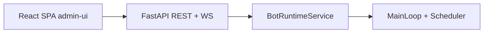

# Local admin panel

The admin panel is a **localhost-only** control plane: REST API plus WebSocket events for logs and status. It does not replace `bot.py`; it drives the same scheduler and main loop in a background thread.

## Architecture

- **Backend**: FastAPI (`src/admin/api/`), optional `ADMIN_TOKEN` (Bearer for HTTP, `token` query or Bearer for WebSocket).
- **Runtime**: `BotRuntimeService` (`src/admin/application/bot_runtime.py`) — single background thread, cooperative stop after the current cycle; pause/resume via `Scheduler` and `data/bot_state.json` (aligned with the CLI).
- **Config**: `ConfigRepository` — atomic YAML writes, masked secrets on GET, merge of blank secrets on PUT from the previous file.
- **Logs**: `BroadcastLogHandler` attaches to the root logger when the admin app starts; events are redacted (same pipeline as `JsonFormatter`).



## Run

**API only (no built UI):**

```bash
source .venv/bin/activate
python run_admin.py
```

Defaults: bind `127.0.0.1`, port `8080`. OpenAPI at `http://127.0.0.1:8080/docs`.

**With the SPA from one URL** (production-style):

```bash
cd admin-ui && npm install && npm run build
cd .. && python run_admin.py
```

Then open `http://127.0.0.1:8080/` — static files are served from `admin-ui/dist` when present.

**Development** (hot reload UI, proxy to API):

```bash
# Terminal 1
python run_admin.py

# Terminal 2
cd admin-ui && npm install && npm run dev
```

Vite proxies `/api` and `/ws` to `http://127.0.0.1:8080`.

## Environment variables

| Variable | Default | Purpose |
|----------|---------|---------|
| `ADMIN_BIND` | `127.0.0.1` | Listen address. Do not expose on `0.0.0.0` without TLS and auth in front. |
| `ADMIN_PORT` | `8080` | HTTP port. |
| `ADMIN_RELOAD` | unset | If `1` / `true` / `yes`, uvicorn reload (dev). |
| `ADMIN_TOKEN` | unset | If set, all protected routes and `/ws/events` require the token. `/api/health` stays public. |
| `BOT_CONFIG` | `config.yaml` | Path passed to config load/save (same as CLI). |

If `ADMIN_TOKEN` is unset, anyone who can open `127.0.0.1` on the machine can use the panel — acceptable for local dev; set a token for shared machines.

## API overview

- `GET /api/health` — liveness.
- `GET/PUT /api/config` — masked GET; PUT validates `AppConfig`; optional `?allow_incomplete=true` (see `skip_secret_validation` — use only for onboarding).
- `POST /api/config/bootstrap` — copy `config.example.yaml` → `config.yaml` if missing.
- `GET/POST /api/runtime/*` — status, start, stop, pause, resume, dry-run once.
- `GET/PUT /api/targets` — YAML-backed targets.
- `GET /api/replies/recent`, stats, DB summary, etc. — see OpenAPI.
- `POST /api/jobs/*` — knowledge-update, performance, suggest-targets, report.
- `WS /ws/events` — JSON events (`log`, `status`, `cycle_end`, …); connect with `?token=...` when `ADMIN_TOKEN` is set.

## Security notes

- Bind to loopback by default; do not put this behind the public internet without a reverse proxy, TLS, and strong auth.
- GET config never returns raw secrets; WebSocket log payloads are redacted.
- PUT config replaces secrets when provided; omitting a masked field may merge from the previous file depending on UI/API contract — see `ConfigRepository` behavior.

## Troubleshooting

1. **401 on API** — Set `Authorization: Bearer <ADMIN_TOKEN>` or unset `ADMIN_TOKEN` for local-only use.
2. **WebSocket disconnects** — Check `token` query matches `ADMIN_TOKEN` when enabled.
3. **UI 404 in production** — Run `npm run build` in `admin-ui` so `admin-ui/dist` exists.
4. **Two bot processes** — Only one `BotRuntimeService` loop should run; use the panel or `bot.py start`, not both against the same state files, unless you understand the overlap.

For implementation details, see `src/admin/` and `tests/test_admin_api.py`.
